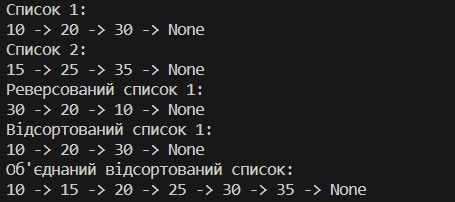
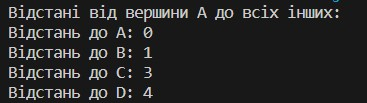
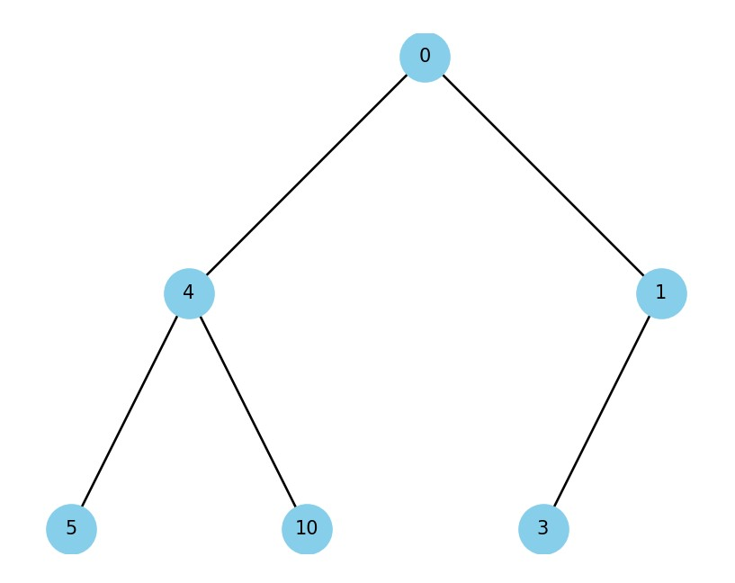
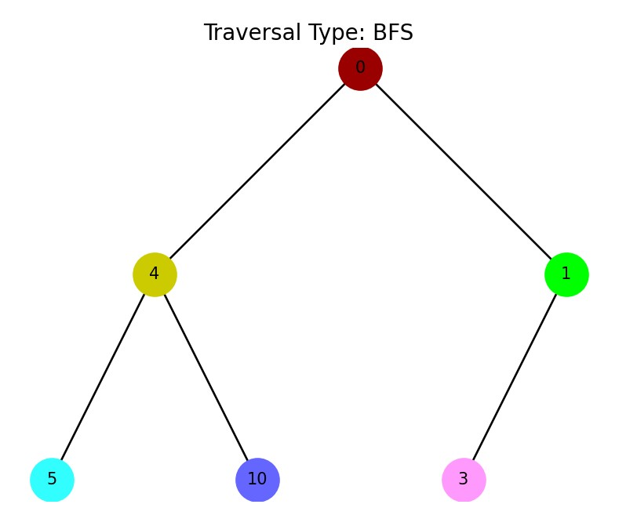
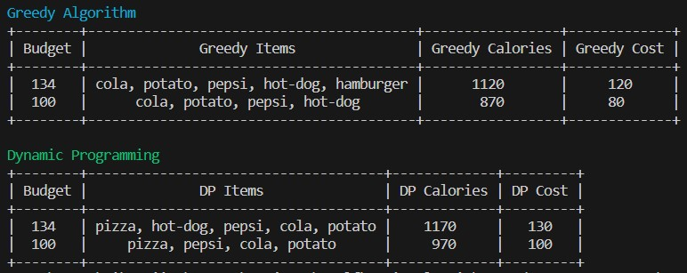
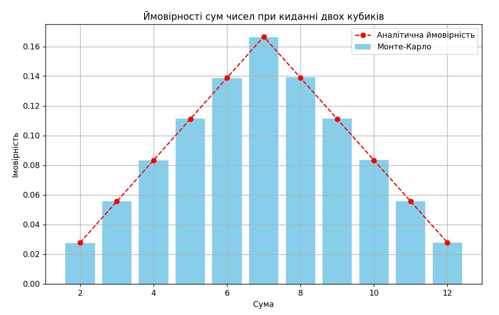
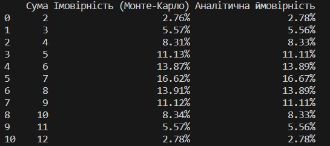

# woolf-algo-fp

### Завдання 1. Структури даних. Сортування. Робота з однозв'язним списком

### Завдання 2. Рекурсія. Створення фрактала “дерево Піфагора” за допомогою рекурсії

### Завдання 3. Дерева, алгоритм Дейкстри

### Завдання 4. Візуалізація піраміди

### Завдання 5. Візуалізація обходу бінарного дерева

### Завдання 6. Жадібні алгоритми та динамічне програмування

### Завдання 7. Використання методу Монте-Карло

### Оцінка ймовірностей методом Монте-Карло

### Огляд

Метод Монте-Карло використовується для оцінки ймовірностей різних сум, які можуть випасти при киданні двох кубиків. У цьому завданні ми порівняли результати симуляції з аналітичними розрахунками ймовірностей кожної можливої суми.

### Аналіз результатів

1. **Результати симуляції та аналітичні розрахунки**:
   - Ймовірності, отримані за допомогою методу Монте-Карло, дуже близькі до аналітичних значень.
   - Для деяких сум спостерігаються невеликі відхилення, що є очікуваним результатом випадкової природи симуляційного методу.

2. **Таблиця порівняння**:
   - У таблиці наведено ймовірності, отримані методом Монте-Карло, та аналітичні ймовірності.
   - Як видно з таблиці, різниця між результатами невелика, що підтверджує правильність симуляції.
   - Наприклад, для суми 7 ймовірність за методом Монте-Карло становить 16.62%, тоді як аналітична ймовірність становить 16.67%.
   - Для суми 2 ймовірність за методом Монте-Карло становить 2.76%, тоді як аналітична ймовірність становить 2.78%.

3. **Графічне представлення**:
   - Графік чітко показує, що ймовірності, отримані методом Монте-Карло, майже збігаються з аналітичними.
   - Найвища ймовірність (для суми 7) за методом Монте-Карло становить 16.62%, що дуже близько до аналітичного значення 16.67%.
   - Це ще раз підтверджує правильність реалізації методу Монте-Карло.

### Висновок

Метод Монте-Карло є надійним та ефективним інструментом для оцінки ймовірностей у випадкових процесах. У цьому завданні результати симуляції дуже близькі до аналітичних значень, що підтверджує правильність і точність розрахунків. Незначні відхилення пояснюються випадковістю симуляційного процесу і можуть бути зменшені шляхом збільшення кількості симуляцій.
